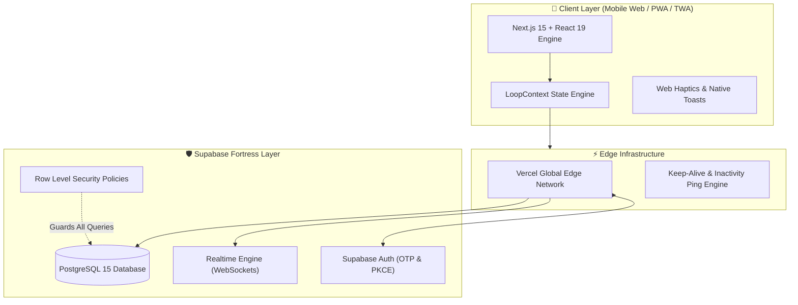

<div align="center">

# ⚡ LOOP
### *Real-Time Campus Ride-Sharing & Coordination Engine*

[](https://loop-demo-app.vercel.app)
[](https://nextjs.org/)
[](https://www.typescriptlang.org/)
[](https://supabase.com/)
[](https://tailwindcss.com/)
[](LICENSE)

<br/>

> **"Rides go better in LOOP."**  
> A mobile-first, zero-friction campus commute coordination platform built to eliminate ₹200+ solo auto fares and chaotic WhatsApp coordination groups.

<br/>

[🚀 Explore Live App](https://loop-demo-app.vercel.app) • [✨ Key Features](#-features) • [🛡️ Security & Privacy](#-fortress-security--privacy) • [🏗️ Architecture](#️-system-architecture) • [⚡ Quickstart](#-getting-started)

</div>

---

## 🎯 The Problem & The LOOP Solution

| ❌ The Old Way (WhatsApp Chaos) | ✅ The LOOP Experience |
|:---|:---|
| **Lost Messages**: Coordination requests buried within seconds under 1,024-member group spam. | **Ephemeral Ride Cards**: Real-time listings filtered by destination, departure time, and available seats. |
| **High Costs**: Paying ₹150 – ₹300 solo for an auto ride from campus into Vijayawada / Guntur. | **Automatic Fare Split**: Equal cost calculation built-in (bringing fares down to ₹40 – ₹60/person). |
| **Privacy Leaks**: Personal phone numbers publicly exposed to thousands in open group chats. | **Fortress Privacy**: Phone numbers masked; zero personal data scraping via Supabase RLS. |
| **Language Barrier**: Out-of-state students struggling to negotiate with Telugu-speaking auto drivers. | **Telugu Auto Guide**: Native phrases + phonetic guides + fare estimates ready at one tap. |

---

## ✨ Features

### ⚡ 1. Real-Time Coordination
- **Sub-50ms Sync**: Powered by Supabase Realtime Channels for live seat booking, instant host acceptances, and passenger updates.
- **Seat Matrix**: Interactive visual seat grid (2 to 10 seats) showing remaining availability at a glance.
- **In-Ride Group Chat**: Isolated, ride-specific encrypted chat that self-destructs after completion.

### 🛡️ 2. Fortress Security & Safety
- **Female-Only Loops**: Dedicated filter & security policy ensuring comfortable travel options for female students.
- **Emergency SOS Dispatch**: One-tap trigger that instantly shares live ride telemetry and GPS coordinates with trusted emergency contacts.
- **Student Email Verification**: Automated gating preventing unauthorized outsiders from entering the campus network.

### 🗣️ 3. Telugu Auto-Rickshaw Companion
- Handcrafted dialect phrases tailored specifically for the Vijayawada / Guntur / Tenali transit corridors.
- Includes English context, phonetic pronunciation, Telugu script, and official fair price guidelines.

### 🎨 4. Engineered for Mobile-First Perfection
- **Zero Vertical Scroll**: Core screens fit natively on any smartphone viewport without awkward page scrolling.
- **True AMOLED Black (`#000000`)**: Saves battery on OLED displays while keeping an ultra-clean, minimal aesthetic.
- **Haptic Feedback**: Micro-vibrations on button taps, seat selections, and tab transitions for a native app feel.

---

## 🏗️ System Architecture



---

## 🔒 Fortress Security & Privacy

LOOP is engineered with a **zero-trust database architecture**:

1. **Row Level Security (RLS)**: Enforced across all tables (`loops`, `loop_members`, `messages`, `profile_contacts`). A user can *never* query data from rides they are not part of.
2. **Hidden Phone Numbers**: Contact numbers are isolated in a restricted table accessed solely via a `SECURITY DEFINER` RPC function (`get_loop_contacts`), callable only by verified co-passengers.
3. **DPDP Act (2023) Ready**: Built-in 1-tap account and data erasure (`/api/account/delete`) complying with modern data protection regulations.

---

## 🛠️ Tech Stack

```
Frontend:     Next.js 15 (App Router) • React 19 • TypeScript • Tailwind CSS 4
Icons:        Lucide React
Backend:      Supabase (PostgreSQL 15, Auth, Realtime)
Deployment:   Vercel Edge Platform
Mobile PWA:   Service Worker • Web App Manifest • Bubblewrap TWA Ready
Design:       Space Grotesk Typography • Pure AMOLED Black (#000000)
```

---

## ⚡ Getting Started

### Prerequisites
- [Node.js](https://nodejs.org/) (v18.18+ or v20+)
- A [Supabase](https://supabase.com/) project

### 1. Clone the Repository
```bash
git clone https://github.com/sanjaykamal2006/Loop.git
cd Loop/Loop-App-2-codebase
```

### 2. Install Dependencies
```bash
npm install
```

### 3. Setup Environment Variables
Create a `.env` file in the root directory:
```env
NEXT_PUBLIC_SUPABASE_URL=https://your-project.supabase.co
NEXT_PUBLIC_SUPABASE_ANON_KEY=your-supabase-anon-key
SUPABASE_SERVICE_ROLE_KEY=your-service-role-key
```

### 4. Run Development Server
```bash
npm run dev
```
Open [http://localhost:3000](http://localhost:3000) in your browser (switch to mobile device mode in DevTools for the intended view).

---

## 📱 Progressive Web App (PWA) Install

LOOP is built to run as an installed app on iOS and Android:
1. Open [loop-demo-app.vercel.app](https://loop-demo-app.vercel.app) in your mobile browser.
2. Tap **Share** (iOS Safari) or the **Three Dots** (Android Chrome).
3. Select **"Add to Home Screen"**.

---

## 👨‍💻 Creator & Maintainer

<div align="center">
  <h3>Sanjay Kamal S</h3>
  <p><em>Built with passion for the university student community.</em></p>

  [](https://openinapp.link/si31z)
  [](https://linkedin.openinapp.co/djr8q)
  [](https://insta.openinapp.co/uekq6)
  [](mailto:loopdeveloper8@gmail.com)
</div>

---

<div align="center">
  <sub>© 2026 LOOP. Designed for campus movement.</sub>
</div>
